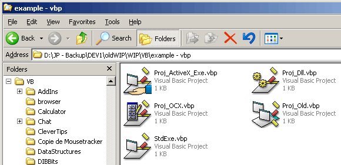

## Icons4VB \*UPDATED\* \- Display different icons in explorer for VB projects, depending on their type

### Description

This is a Shell Extension (Icon Handler) for VB files, written in VB. It allows you to display different icons in explorer for project and form files, depending on their type - very useful for opening the correct project. The code is quite simple, and well-commented. Also included are replacement icons for the relevant VB files, in multiple formats up to 48x48 in 32-bit colour.
 
### More Info
 

             |
---                |---
**Submitted On**   |2004-03-30 10:34:08
**By**             |[grigri](https://github.com/Planet-Source-Code/PSCIndex/blob/master/ByAuthor/grigri.md)
**Level**          |Advanced
**User Rating**    |4.8 (24 globes from 5 users)
**Compatibility**  |VB 6\.0
**Category**       |[OLE/ COM/ DCOM/ Active\-X](https://github.com/Planet-Source-Code/PSCIndex/blob/master/ByCategory/ole-com-dcom-active-x__1-29.md)
**World**          |[Visual Basic](https://github.com/Planet-Source-Code/PSCIndex/blob/master/ByWorld/visual-basic.md)
**Archive File**   |[Icons4VB\_\_172840442004\.zip](https://github.com/Planet-Source-Code/grigri-icons4vb-updated-display-different-icons-in-explorer-for-vb-projects-depending-on-t__1-52781/archive/master.zip)

